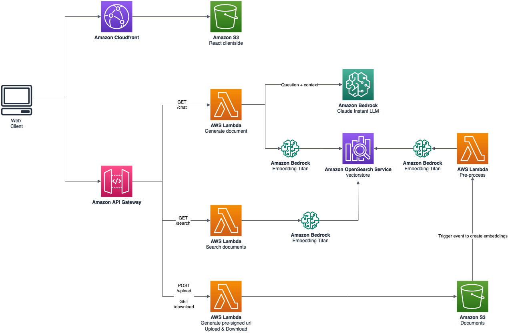

# ScriptSense demo GenerativeAI

## Architecture

## Requirements

It is recommended to run this sample in a **sandbox account**. The sample has no tests and not all security best practices are implemented.

To deploy the solution it is necessary:

- [AWS CLI](https://docs.aws.amazon.com/en_us/cli/latest/userguide/getting-started-install.html) configured with a user that has Admin permissions. This user will be used by AWS SAM
- [AWS SAM CLI](https://docs.aws.amazon.com/serverless-application-model/latest/developerguide/install-sam-cli.html) installed
- Solution tested in _us-east-1_ region
- Node.js v18.16.0, NPM v9.5.1, Python v3.8.8

## Getting Started

1. Deploy the [backend](./backend/README.md)
2. Change the API endpoint in [services](./frontend/src/services/api.js)
3. Deploy the [frontend](./frontend/README.md)
